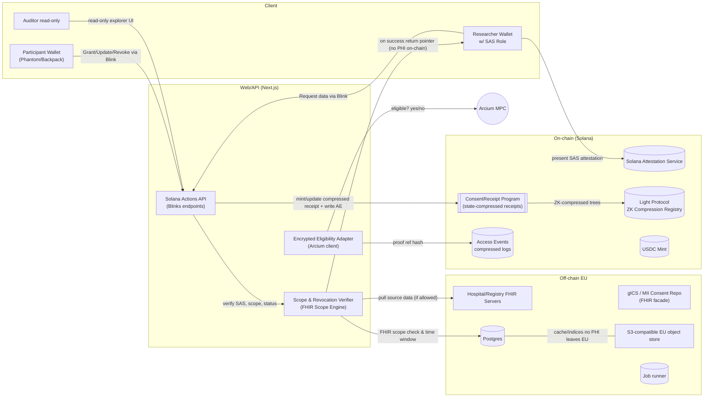
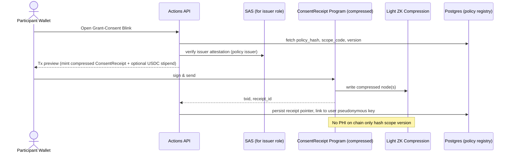
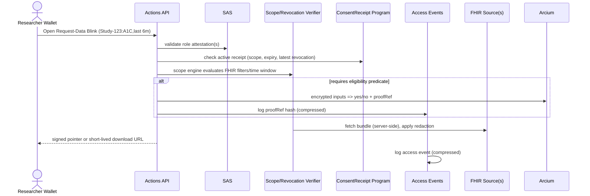
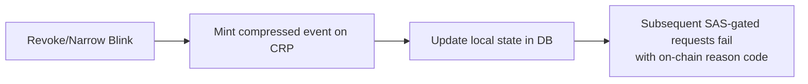
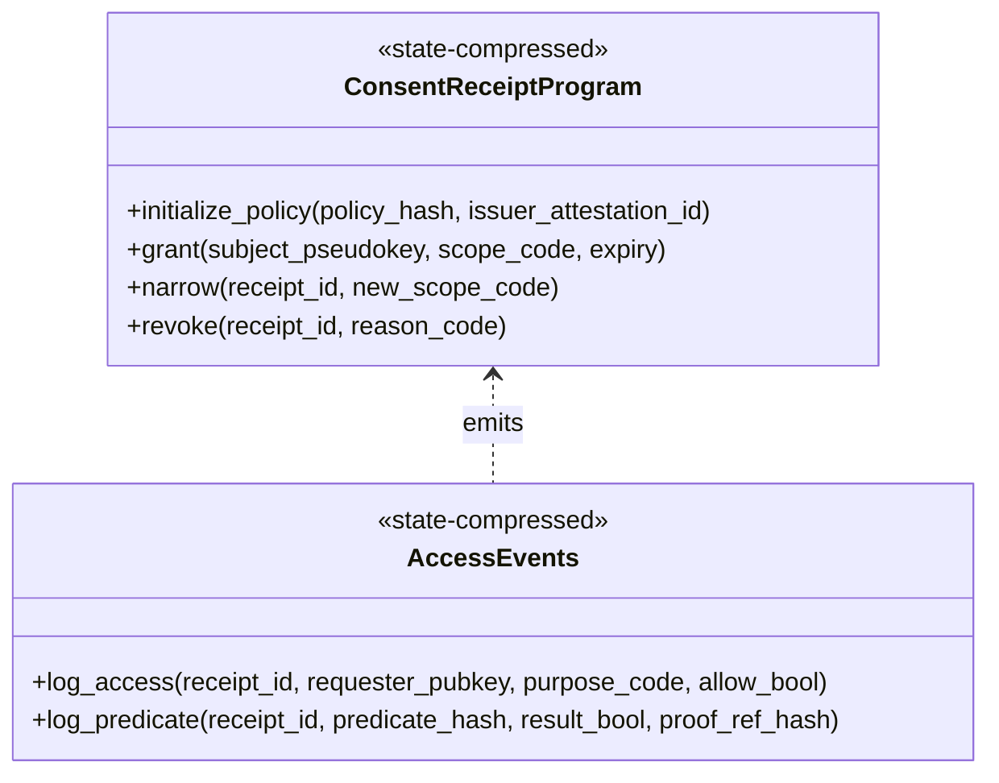
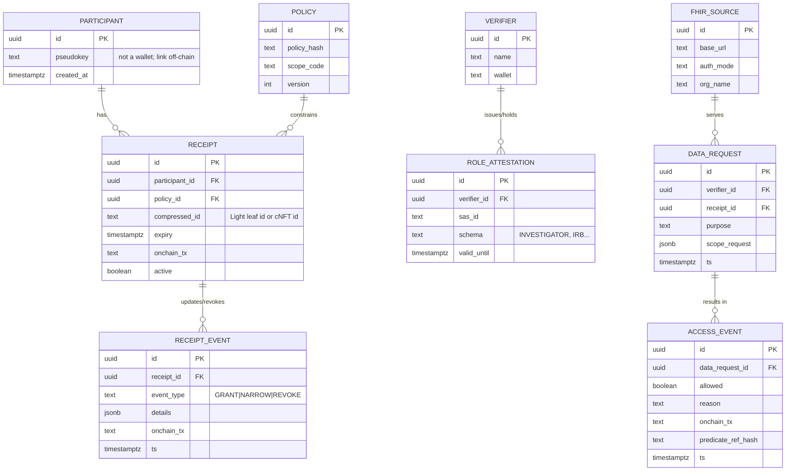
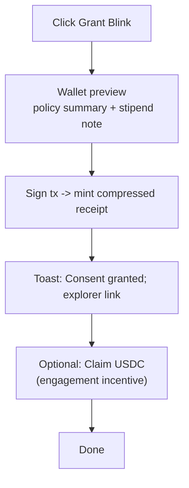
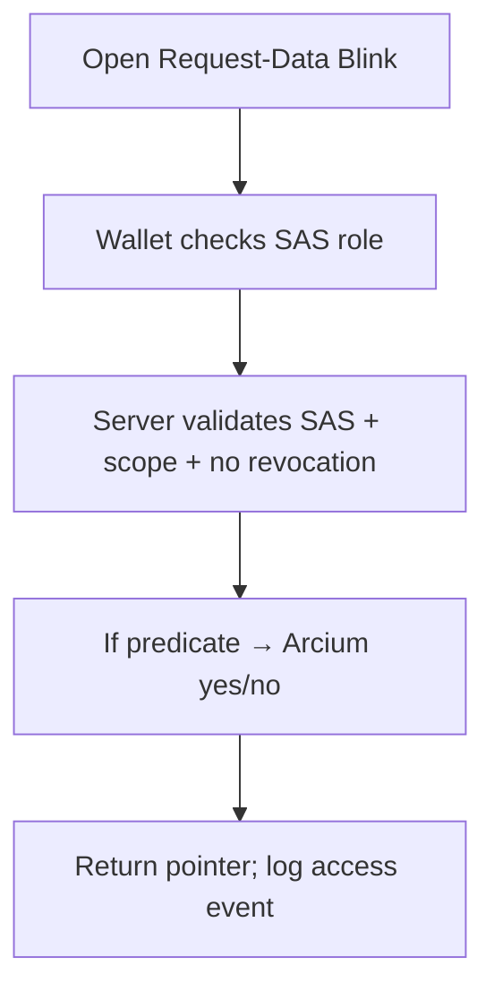
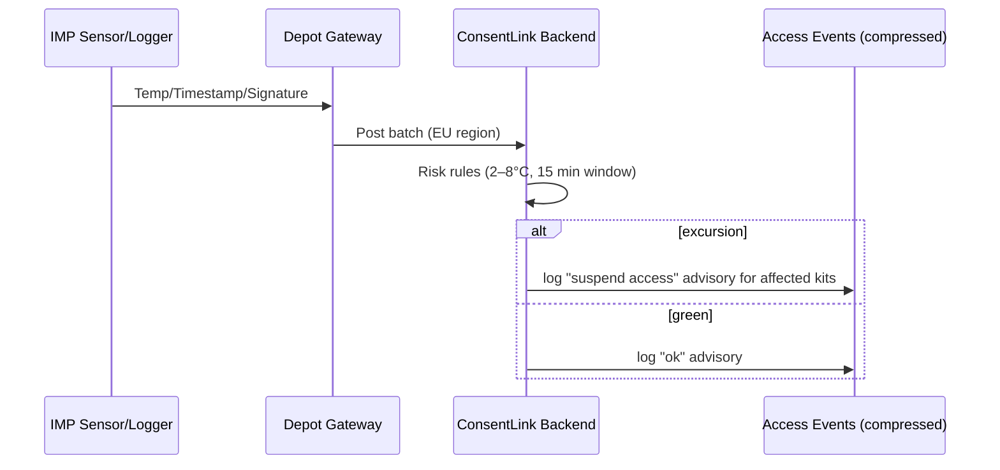
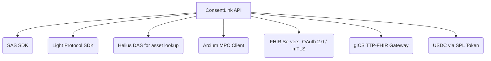

# Kasu---Consent-Link
Consent -> Reward

---

# High-level architecture (Mermaid)



**Why these rails (2025):**

* **Blinks** give click-to-consent UX anywhere (X/Discord/web). ([Solana][1])
* **SAS** provides reusable, verifiable role credentials (IRB/Ethik-Kommission approved investigator, site). ([GitHub][2])
* **Light Protocol ZK Compression** makes consent receipts & revocations rent-free at L1 scale. ([GitHub][3])
* **Arcium** handles encrypted eligibility predicates with a Q4-2025 mainnet-alpha runway. ([arcium.com][4])
* **FHIR Consent** profiles + use-case IGs define computable scope & exchange. ([build.fhir.org][5])
* **German MII Broad Consent/gICS** ensure alignment with hospital reality. ([medizininformatik-initiative.de][6])
* **EHDS (EU) & GDNG (DE)** make auditability/secondary-use governance mandatory over 2025–2029+. ([Public Health][7])

---

# End-to-end data flows

## 1) Participant “Grant Consent” (Blink)



## 2) Researcher “Request Data” (Blink)



## 3) Revocation/Narrowing



---

# Smart-contract architecture



* **Compression:** use **Light Protocol ZK Compression** for receipts & events (rent-free, L1-verifiable). Fallback: **Metaplex Bubblegum v2** cNFTs if you prefer asset semantics. ([zkcompression.com][8])
* **Role checks:** off-chain verifier enforces **SAS** attestations before allowing any request Action. ([Solana][9])
* **USDC micropayments (optional):** payouts sent via SPL token (Token Program/Token-2022). ([Solana][10])

---

# Technology stack & package notes (Oct 2025)

* **Solana Actions/Blinks:** server endpoints returning signable txs; Phantom renders blinks on X/Discord. ([Solana][1])
* **@solana/web3.js:** latest 1.98.x; upgrade advisories exist (1.95.8+)—pin a safe v1.x or plan v2 migration. ([npm][11])
* **Anchor:** 0.31.x stable in 2025 with `LazyAccount` & memory improvements; 0.30.0 release notes. ([Solana Stack Exchange][12])
* **Light Protocol:** ZK Compression SDK + indexer by Helius; whitepaper (Sep 2025). ([GitHub][3])
* **SAS:** mainnet-available service + SDK. ([Solana][9])
* **Arcium:** public testnet (phased), **Mainnet Alpha Q4-2025**. Use examples repo to wire predicates. ([arcium.com][13])
* **FHIR Consent IGs:** HL7 IGs for consent/permissions & consent mgmt v0.1.0. ([build.fhir.org][5])
* **Germany:** MII Broad Consent and **gICS** FHIR façade used across university sites. ([medizininformatik-initiative.de][6])
* **Regulation:** **EHDS** entered into force 26 Mar 2025; **GDNG** in force since 26 Mar 2024. ([Public Health][7])

---

# Database schema (ER + starter DDL)



**Starter DDL (Postgres):**

```sql
create table policy(
  id uuid primary key,
  policy_hash text not null,
  scope_code text not null,
  version int not null
);
create table participant(
  id uuid primary key,
  pseudokey text unique not null,
  created_at timestamptz default now()
);
create table receipt(
  id uuid primary key,
  participant_id uuid references participant(id),
  policy_id uuid references policy(id),
  compressed_id text not null,
  expiry timestamptz not null,
  onchain_tx text not null,
  active boolean default true
);
create table receipt_event(
  id uuid primary key,
  receipt_id uuid references receipt(id),
  event_type text check (event_type in ('GRANT','NARROW','REVOKE')),
  details jsonb,
  onchain_tx text,
  ts timestamptz default now()
);
create index on receipt_event(receipt_id, ts desc);
```

---

# User interaction flows

## Participant UX (Blink surfaces)



Blinks render natively in Phantom and other clients across X/Discord/web. ([docs.phantom.com][14])

## Researcher UX



---

# Temperature monitoring & compliance flow (optional module for DCT supplies)

Use if your study needs **IMP storage/shipping** proofs (GDP) or **Annex 11** validation.



* Aligns with **EU GDP (2013/C 343/01)** expectations for temperature control & traceability and **EU GMP Annex 11** for validated computerized systems; you keep PHI off-chain and anchor only proofs/events. ([EUR-Lex][15])

---

# Compliance guardrails (Germany/EU)

* **EHDS timeline:** in force **26 Mar 2025**; phased applicability via implementing acts; secondary-use governance ramps to 2027–2029+. ([Public Health][7])
* **GDNG (DE):** in force **26 Mar 2024**; establishes national data-access coordination and legal basis for secondary-use. ([BMG][16])
* **Blockchain & GDPR:** EDPB **Guidelines 02/2025** (draft adopted 14 Apr 2025) → avoid personal data on chain; define roles; DPIA required for high-risk; pseudonymous data can still be personal data. We therefore **store only hashes/attestations/events** on L1. ([European Data Protection Board][17])
* **MII Broad Consent & gICS:** standardized consent text and FHIR facade widely used in German university medicine—ConsentLink **integrates** (import status, anchor portable receipts). ([medizininformatik-initiative.de][6])

---

# Integration points



* SAS SDK & schemas → role verification. ([Solana][9])
* Light SDK → mint/update compressed receipts; **Helius DAS** for explorer UI. ([GitHub][3])
* Arcium client → encrypted predicates (eligibility yes/no). ([arcium.com][13])
* FHIR/gICS → consent status import/compatibility with **MII Broad Consent**. ([ths-greifswald.de][18])
* USDC → incentives or stipends (optional). ([Circle Developers][19])

---

# Software Requirements Specification (SRS) — v0.1

**1. Scope**
Provide a portable, verifiable, revocable consent layer for clinical research & secondary use in Germany/EU, with SAS-gated access and encrypted eligibility checks.

**2. References**
EHDS, GDNG, EDPB 02/2025, HL7 FHIR Consent IGs, MII Broad Consent/gICS, Actions/Blinks, Light Protocol, Arcium. ([Public Health][7])

**3. User roles**

* Participant (wallet), Researcher (wallet + SAS), Issuer (policy authority), Auditor (read-only).

**4. Functional requirements**

* FR-01: Mint compressed **ConsentReceipt** with `{policy_hash, scope_code, expiry, issuer_attestation_id}`. (Light Protocol) ([GitHub][3])
* FR-02: Append **NARROW** or **REVOKE** events; verifiers must treat latest state as authoritative.
* FR-03: **SAS** role required to request data; deny absent/expired attestations. ([Solana][9])
* FR-04: Evaluate FHIR scope (purpose, resources, time window) and only return a signed pointer to off-chain bundle. ([build.fhir.org][20])
* FR-05: Optional encrypted eligibility via **Arcium**; persist proofRef hash on-chain. ([arcium.com][13])
* FR-06: **Blinks** for Grant/Update/Revoke/Request; one-tap in supported clients. ([docs.phantom.com][14])

**5. Non-functional requirements**

* NFR-Sec: No PHI on chain; DPIA; EU data residency for storage. (EDPB 02/2025) ([European Data Protection Board][21])
* NFR-Perf: Mint/update < 2s p95 on mainnet; verifier SLA 99.9%.
* NFR-Cost: < €0.002 per receipt/event average (ZK Compression). ([zkcompression.com][8])
* NFR-Audit: Export full audit with on-chain links; Annex 11 validation evidence. ([Public Health][22])

**6. Interfaces**

* Actions API (`/api/actions/grant|narrow|revoke|request`) — JSON schema per Solana Actions. ([Solana][1])
* FHIR client — OAuth2/mTLS; read bundles via scope filter.
* SAS — verify attestation ids; cache with TTL. ([Solana][9])
* Light SDK — mint/update; integrate indexer for explorer. ([GitHub][3])

**7. Data model** — see ER and DDL above.

**8. Security & privacy**

* Wallet addresses for **participants are never public**; use pseudokeys mapped only off-chain.
* Chain stores only commitments (hashes), receipt ids, event types, proofRef hashes. (EDPB/CNIL guidance) ([European Data Protection Board][21])

**9. Localization**

* German/English copy; MII Broad Consent import; DRKS/UKSH pilot-ready. ([PubMed][23])

**10. Acceptance tests (MVP)**

* AT-01: Grant→Revoke blocks a request in < 2s.
* AT-02: Non-attested wallet denied with on-chain reason.
* AT-03: Predicate `age∈[18,65] && A1C≥7` returns yes/no w/ proofRef.

---

# Roadmap — **ConsentLink.md** (BONKChain-style)

> (Use this as your repo README during the hackathon.)

## Day 1 — Rails + First Receipt

**Targets:**

* Grant-Consent **Blink** → compressed **receipt** on mainnet (or testnet), explorer link.
* **SAS** attestation gate for requester.
* **Scope engine** for one FHIR use-case.

**Checklist**

1. **Monorepo:** `/contracts` (Anchor 0.31.x), `/api` (Next.js Actions), `/web` (UI). ([Solana Stack Exchange][12])
2. **Light Protocol:** set up tree + mint receipt leaf with `policy_hash, scope_code, expiry`. ([GitHub][3])
3. **SAS:** local attestation issuer + verifier middleware. ([Solana][9])
4. **Blink:** `GET /api/actions/grant` → preview → sign → receipt minted. ([Solana][1])
5. **DB:** persist receipt and owner pseudokey; build tiny explorer page.

**Done-when:** judge clicks your Blink, sees a compressed receipt and a green “active” badge.

## Day 2 — Revocation + Encrypted Eligibility + Polish

**Targets:**

* **Revoke/Narrow** Blink with on-chain event; subsequent request fails.
* **Arcium** predicate (demo): yes/no + proofRef hash logged. ([arcium.com][13])
* **Researcher Request** Blink (SAS-gated) with scope+revocation check; returns signed pointer to a **synthetic FHIR** bundle. ([build.fhir.org][20])
* **Compliance one-pager** (EHDS, GDNG, EDPB) in repo. ([Public Health][7])

**Nice-to-have:** USDC micropayment (Token Program) as participation incentive. ([Solana][10])

## MVP Feature List

* Portable **ConsentReceipt** (compressed) + lifecycle events. ([zkcompression.com][8])
* **SAS** role gating (IRB/site/investigator). ([Solana][9])
* Encrypted eligibility (Arcium) with on-chain evidence. ([arcium.com][13])
* **Blinks** for Grant/Update/Revoke/Request; explorer UI. ([docs.phantom.com][14])

## Q&A crib

* **Why on chain?** Portable, tamper-evident receipts & revocations align with EHDS auditability; PHI stays off-chain per EDPB. ([Public Health][7])
* **Why Solana?** Blinks UX + SAS roles + ZK Compression economics — unique combo in 2025. ([docs.phantom.com][14])
* **Germany fit?** MII Broad Consent/gICS compatible; GDNG/EHDS timelines. ([medizininformatik-initiative.de][6])

---

# Temperature monitoring & compliance (attachment module)

If your study handles **Investigational Medicinal Products**:

* **GDP** for distribution temperature; **Annex 11** for validated systems (audit trail, security, change mgmt). Your module logs **on-chain advisory events** (green/red) for kits/batches without storing PHI. ([EUR-Lex][15])

---

# “Best-possible MVP” checklist (hard-mode)

* [ ] **Grant Blink → compressed receipt** (Light). ([GitHub][3])
* [ ] **Revoke Blink** → request fails with on-chain reason code.
* [ ] **SAS check** denies non-attested wallet. ([Solana][9])
* [ ] **Arcium predicate** logs proofRef hash (demo predicate). ([arcium.com][13])
* [ ] **Explorer UI** shows receipts + events + attestation state (DAS if using cNFT fallback). ([Helius][24])
* [ ] **Compliance one-pager** (no PHI on chain; DPIA note; EHDS/GDNG cites). ([European Data Protection Board][21])

---

## Appendix — Example API contracts

```ts
// GET /api/actions/grant
// returns an Action payload with a transaction that mints a compressed receipt leaf
type GrantRequest = { policyId: string; locale?: 'de'|'en' }
type GrantPreview = { policyHash: string; scopeCode: string; expiryISO: string }
```

```ts
// POST /api/verify-request
// server-side check before returning a pointer to a FHIR bundle
type VerifyBody = { requesterWallet: string; receiptId: string; scopeReq: object }
type VerifyResp = { allowed: boolean; reason?: string; pointer?: string }
```

---

If you want, I can drop this as a repo-ready **`ConsentLink.md`** with the Mermaid diagrams and the SRS bundled, plus stubbed Next.js/Anchor scaffolding that compiles against **Anchor 0.31.x**, **web3.js 1.98.x**, **Light SDK**, **SAS**, and an Arcium predicate demo.

[1]: https://solana.com/developers/guides/advanced/actions?utm_source=chatgpt.com "Actions and Blinks"
[2]: https://github.com/solana-foundation/solana-attestation-service?utm_source=chatgpt.com "GitHub - solana-foundation/solana-attestation-service ..."
[3]: https://github.com/Lightprotocol/light-protocol?utm_source=chatgpt.com "Lightprotocol/light-protocol: The ZK Compression ..."
[4]: https://www.arcium.com/articles/arcium-roadmap-update?utm_source=chatgpt.com "Arcium Roadmap Update"
[5]: https://build.fhir.org/ig/HL7/data-access-policies/consent.html?utm_source=chatgpt.com "Consent - HL7 FHIR Implementation Guide: Data Access ..."
[6]: https://www.medizininformatik-initiative.de/en/template-text-patient-consent-forms?utm_source=chatgpt.com "Template text for patient consent forms"
[7]: https://health.ec.europa.eu/ehealth-digital-health-and-care/european-health-data-space-regulation-ehds_en?utm_source=chatgpt.com "European Health Data Space Regulation (EHDS)"
[8]: https://www.zkcompression.com/references/whitepaper?utm_source=chatgpt.com "Whitepaper"
[9]: https://solana.com/news/solana-attestation-service?utm_source=chatgpt.com "Solana Attestation Service"
[10]: https://solana.com/docs/tokens/basics/create-token-account?utm_source=chatgpt.com "Create a Token Account"
[11]: https://www.npmjs.com/package/%40solana/web3.js/?utm_source=chatgpt.com "@solana/web3.js - npm"
[12]: https://solana.stackexchange.com/questions/20824/what-has-changed-from-anchor-version-0-30-1-to-version-0-31-0?utm_source=chatgpt.com "What has changed from anchor version 0.30.1 to ..."
[13]: https://www.arcium.com/articles/arcium-public-testnet-launch-guide?utm_source=chatgpt.com "The Arcium Public Testnet Launch Guide"
[14]: https://docs.phantom.com/developer-powertools/solana-actions-and-blinks?utm_source=chatgpt.com "Solana Actions and Blinks"
[15]: https://eur-lex.europa.eu/LexUriServ/LexUriServ.do?uri=OJ%3AC%3A2013%3A343%3A0001%3A0014%3AEN%3APDF&utm_source=chatgpt.com "Guidelines of 5 November 2013 on Good Distribution Practice ..."
[16]: https://www.bundesgesundheitsministerium.de/service/gesetze-und-verordnungen/detail/gesundheitsdatennutzungsgesetz.html?utm_source=chatgpt.com "Gesundheitsdatennutzungsgesetz (GDNG) | BMG"
[17]: https://www.edpb.europa.eu/news/news/2025/edpb-adopts-guidelines-processing-personal-data-through-blockchains-and-ready_en?utm_source=chatgpt.com "EDPB adopts guidelines on processing personal data through ..."
[18]: https://www.ths-greifswald.de/en/announcement-official-comment-process-of-the-fhir-implementation-guide-for-gics/?utm_source=chatgpt.com "Official comment process of the FHIR Implementation Guide ..."
[19]: https://developers.circle.com/stablecoins/quickstart-transfer-10-usdc-on-solana?utm_source=chatgpt.com "Quickstart: Set up and transfer USDC on Solana"
[20]: https://build.fhir.org/ig/HL7/fhir-consent-management/?utm_source=chatgpt.com "Overview - Scalable Consent Management v0.1.0"
[21]: https://www.edpb.europa.eu/system/files/2025-04/edpb_guidelines_202502_blockchain_en.pdf?utm_source=chatgpt.com "Guidelines 02/2025 on processing of personal data through ..."
[22]: https://health.ec.europa.eu/system/files/2016-11/annex11_01-2011_en_0.pdf?utm_source=chatgpt.com "Annex 11: Computerised Systems"
[23]: https://pubmed.ncbi.nlm.nih.gov/40776151/?utm_source=chatgpt.com "Implementation of a Patient Consent Management at a ..."
[24]: https://www.helius.dev/docs/das-api?utm_source=chatgpt.com "Solana DAS API: Unified NFT and Token Data Access"
